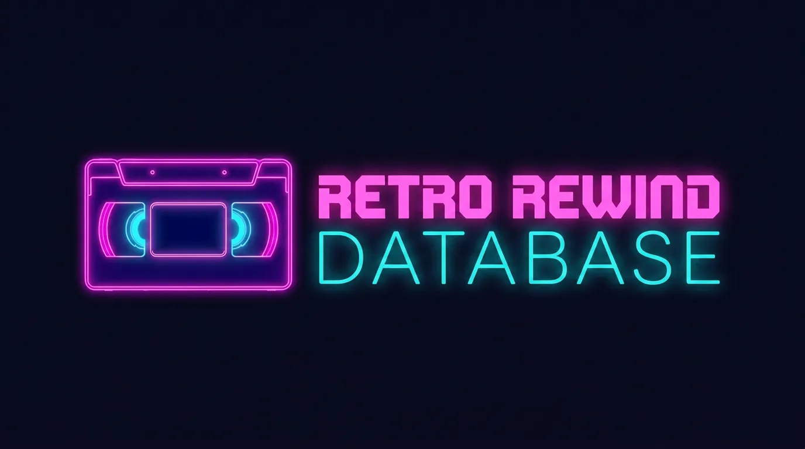

  

# 🌍 Translation – Multilingual Project

Management of translations for the website Retro Rewind Database into different languages.

## 🎯 Goal

The website should be available in multiple languages. This repository manages:

- All language files (PHP)
- All Seeder files with translations for translations table
- Translation quality assurance

## 🗣️ Supported Languages

| Language                                   | Code | Status |
| ------------------------------------------ | ---- | ------ |
| [German](app/Language/de/)                 | `de` | Done   |
| [English](app/Language/en/)                | `en` | Done   |
| [Spanish](app/Language/es/)                | `es` | Done   |
| [French](app/Language/fr/)                 | `fr` | Done   |
| [Italian](app/Language/it/)                | `it` | Done   |
| [Portuguese (Brazilian)](app/Language/pt/) | `pt` | Done   |

- More languages will be added if the game is converted to more languages

Some translations have been generated by AI
